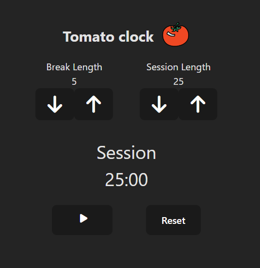

Build an app that is functionally similar to this: https://javascript-calculator.freecodecamp.rocks/.

Digit 'npm install && npm run dev' to run the project and use the tomato clock to keep the rytm.

